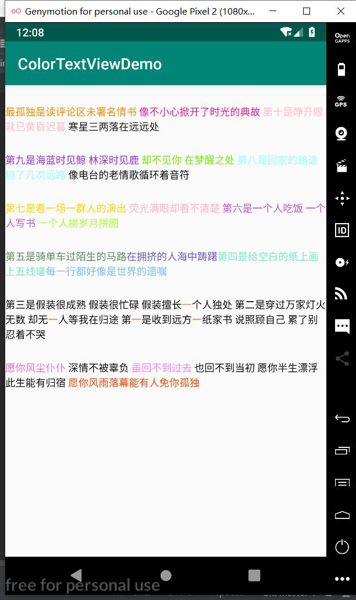

# MultiColorTextView



## 引用

在gradle中引用:

```groovy
implementation 'com.dreamlin.colortextview:colortextview:1.0.0'
```


## 属性

| 属性         | 说明                        | 示例                                                     |
| ------------ | --------------------------- | -------------------------------------------------------- |
| app:colors   | 颜色串，默认使用 '\|'字符分割 | "#FF0000\|#00FF00\|#0000FF"                              |
| app:texts    | 字符串，默认使用'\|'字符分割 | "愿你风尘仆仆\|深情不被辜负\|虽回不到过去\|也回不到当初" |
| app:defColor | 默认颜色，不指定默认为黑色  | "#FFC125"                                                |
| app:spilt    | 分隔符，默认为字符'\|'       | "="、"\|"等                                              |


## 使用

支持两种方式：

### 在xml中使用

```xml
<com.dreamlin.colortextview.MultiColorTextView
    android:layout_width="wrap_content"
    android:layout_height="wrap_content"
    android:layout_marginTop="25dp"
    android:textSize="13sp"
    app:colors="#FF8C00|#FF1493|#FFC0CB|"
    app:defColor="#0D0D0D"
    app:texts="最孤独是读评论区未署名情书|
    像不小心掀开了时光的典故|
    第十是睁开眼就已黄昏迟暮|
    寒星三两落在远远处" />

```

默认使用字符`|`进行分割，当然你也可以通过`spilt`属性指定分隔符

### 在代码中使用

```java
tvSetText.setColorTexts("第五是骑单车过陌生的马路|在拥挤的人海中踌躇|第四是给空白的纸上画上五线谱|每一行都好像是世界的遗嘱", "#548B54|#6959CD|#76EEC6|#7EC0EE")
```

除此之外，还支持在代码中替换匹配文字的颜色：

- 单字符串匹配修改颜色

```java
//注意使用该方法会使其他文字颜色失效
tvRegexOne.applyColorForText("一", "#FF7F24")
```

- 多字符串匹配修改颜色

```java
tvRegexMulti.applyColorForTexts(new String[]{"#FF6EB4", "#FF83FA", "#FF4500"}, "愿你风尘仆仆", "虽回不到过去", "愿你风雨落幕能有人免你孤独")
```

具体效果可查看Demo

